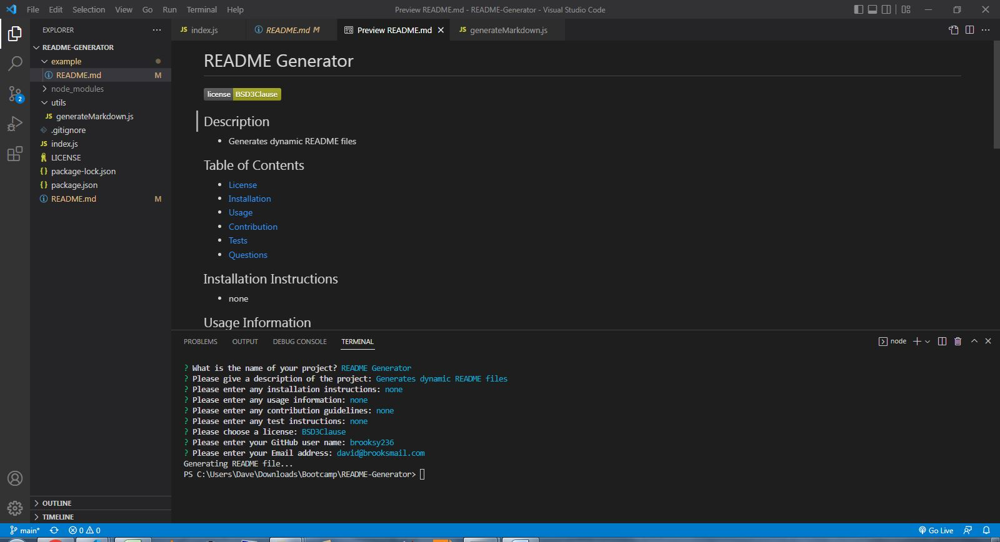

# README Generator

   

  ## Description
  - The README Generator dynamically generates a top notch README for you project with all the headings you need and a choice of licenses.

  ## Table of Contents

  - [License](#license)
  - [Installation](#installation-instructions)
  - [Usage](#usage-information)
  - [Contribution](#contributon-guidelines)
  - [Tests](#test-instructions)
  - [Questions](#questions)

  ## Installation Instructions
  - No need to install, you just need to have Node.js on your machine to run it.

  ## Usage Information
  - You can use it for any project. This README was created with it!
   
   

  ## Contributuon Guidelines
  - N/A

  ## Test Instructions
  - N/A

  ## Questions

  - You can find more of my work at (https://github.com/brooksy236/).
  

  ## License
  - MIT
